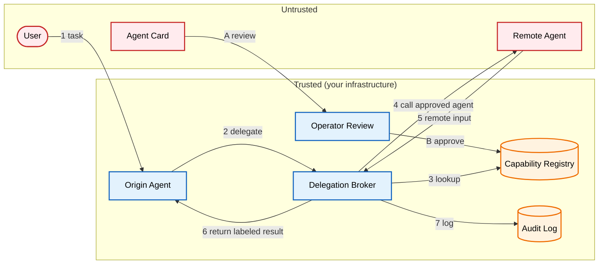

# A2A Remote Agent Discovery: Trust the Registry, Not the Agent Card

An Agent Card is a business card for a remote agent. It tells other agents how to find and call it. In A2A-style systems, the remote agent publishes this card so other agents can discover it. The card should not decide whether your agent is allowed to delegate work.

If an origin agent calls a remote agent just because it found a card, discovery has become authorization. That can send user context and task data to a remote agent before anyone has approved that delegation. The safer pattern is to review Agent Cards before they become callable, register approved agents, and route runtime delegation through a broker that enforces the registry decision.

[**Read the full context on securepatterns.dev**](https://newsletter.securepatterns.dev/p/a2a-remote-agent-discovery-trust-the-registry-not-the-agent-card)

## System Description

An origin agent may discover remote agents through Agent Cards, but it cannot call a discovered agent directly. Approved agents are added to a capability registry first. At runtime, the origin delegates through a broker, and the broker only calls agents that are already approved in the registry.

## Security Artifacts

- [Threat Model](threat_model.md): Risks at the discovery-to-delegation boundary, with mitigation options keyed to the registry, broker, and delegation token
- [Verification Checklist](checklist.md): A manual test list to audit your implementation
