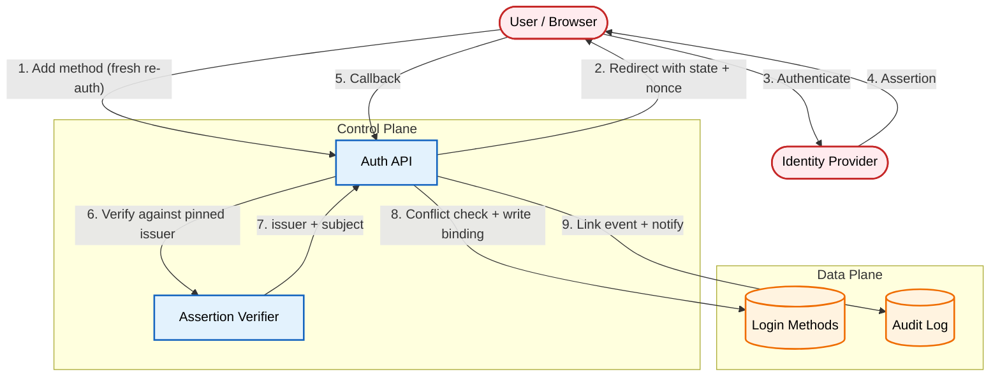

# Designing a Safe Account Linking Flow

A login method is a credential binding, not an email match.

[Read the full post on securepatterns.dev](https://newsletter.securepatterns.dev/p/designing-a-safe-account-linking-flow)

## System Description

Each account keeps a list of login methods. A method is a record that binds a provider's issuer and stable subject to the account; sign-in resolves accounts through that binding. Adding a method requires a fresh authentication of the account it joins.

## Security Artifacts

- [Threat Model](threat_model.md): Risks across adding a method, sign-in resolution, and lifecycle/policy
- [Verification Checklist](checklist.md): A manual test list to audit your implementation
