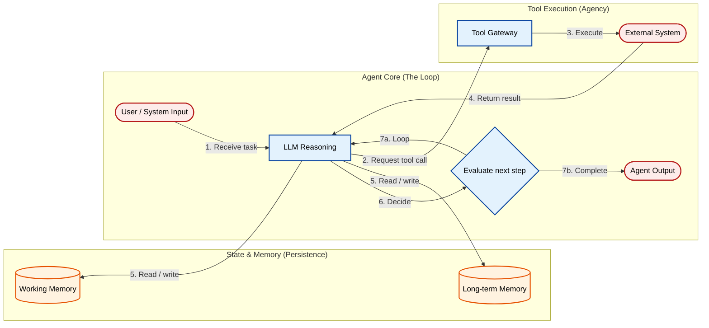

# The AI Agent Attack Surface: Tools, Loops, and Memory

Agents don’t just generate text. They execute tools, persist memory, and make decisions across multiple steps. Each of these capabilities introduces a new security boundary. When they combine, they create an attack surface that doesn’t exist in stateless LLM applications.

This post breaks that attack surface into three primitives: tools, loops, and memory; and threat models each one.

[**Read the full context on securepatterns.dev**](https://newsletter.securepatterns.dev/p/ai-agent-attack-surface-tools-loops-and-memory)

## System Description

An agent is a pipeline where an LLM reasons about a task, executes tool calls against external systems, stores results in memory, and loops until the task is complete or a termination condition fires. The three primitives (tools, loop, memory) are the security boundaries that don't exist in a stateless LLM wrapper.

## Security Artifacts

- [Threat Model](threat_model.md): Risks across tool calls, the loop, state and memory, and cross-primitive chains
- [Verification Checklist](checklist.md): A manual test list to audit your implementation
