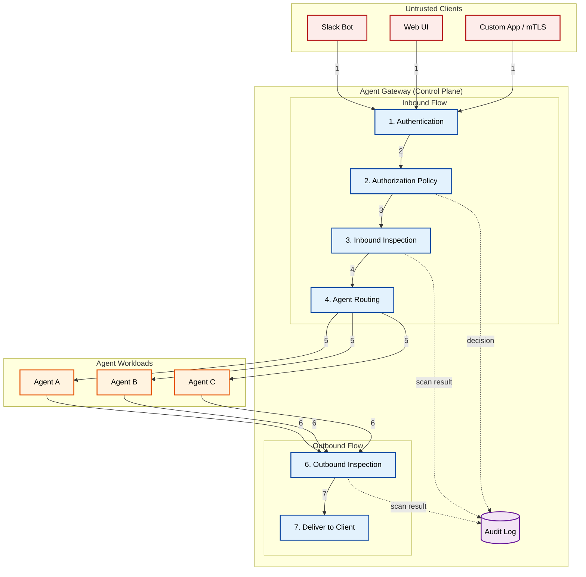

# AI Agent Gateway: The Authorization Chokepoint

An architectural pattern for mediating all communication between client applications and AI agents through a centralized gateway that enforces authorization, inspects payloads in both directions, and logs every interaction.

[**Read the full context on securepatterns.dev**](https://newsletter.securepatterns.dev/p/ai-agent-gateway-the-authorization-chokepoint)

## System Description

An AI Agent Gateway sits between client applications and AI agents, mediating every request and response. The gateway enforces authorization, inspects payloads in both directions, and logs every interaction. Agents are workloads. The gateway is the control plane. Client apps are untrusted callers.

## Security Artifacts

- [Threat Model](threat_model.md): Risks across client-to-gateway, gateway-to-agent, and agent-response-to-client phases
- [Verification Checklist](checklist.md): A manual test list to audit your implementation
