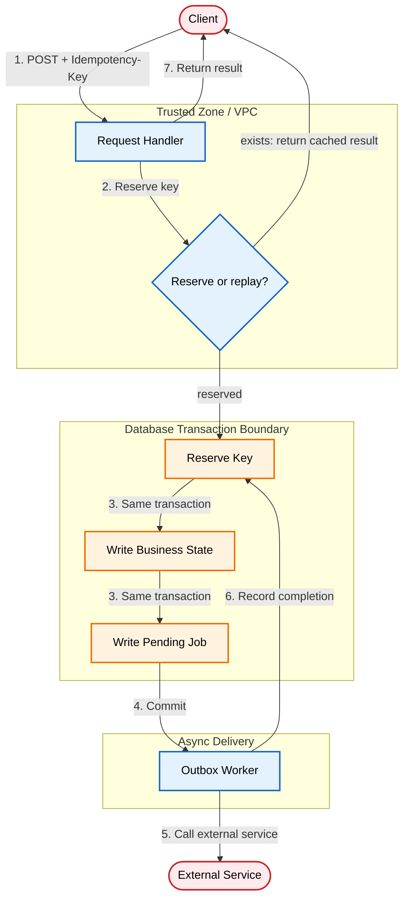

# Designing API Idempotency Keys to Prevent Duplicate Writes

An architectural pattern for API idempotency: atomic key reservation, request fingerprinting, the write-first pattern for safe external calls, and outbox-driven side-effect delivery. The server reserves a client-provided key in a durable store before doing any work, writes business state and a pending job in a single transaction, then hands off external calls to a background worker.

[**Read the full context on securepatterns.dev**](https://newsletter.securepatterns.dev/p/designing-api-idempotency-keys-to-prevent-duplicate-writes)

## System Description

An API receives a state-changing request with an `Idempotency-Key` header, reserves the key in a durable store before doing any work, writes the business state and a pending job in a single transaction, then hands off external side effects to a background worker. On a valid retry for the same request, the server returns the cached result instead of reprocessing.

## Security Artifacts

- [Threat Model](threat_model.md): Risks across key reservation, processing, delivery, and lifecycle phases
- [Verification Checklist](checklist.md): A manual test list to audit your implementation
