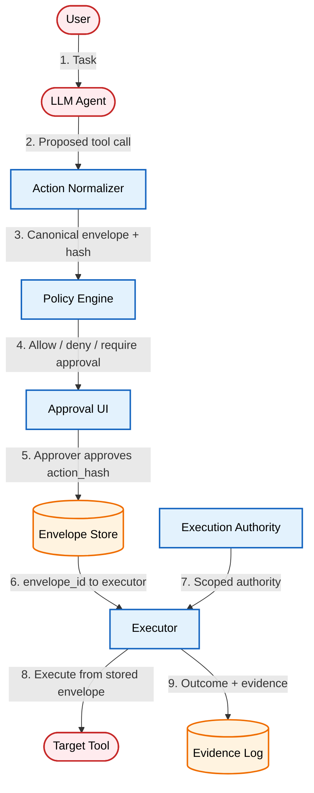

# Approval-Bound Tool Execution for AI Agents

Bind approval to the exact tool call, not the agent's description of it.

[Read the full post on securepatterns.dev](https://newsletter.securepatterns.dev/p/approval-bound-tool-execution-for-ai-agents)

## System Description

The approval system binds every approved action to an `action_hash` computed over the full normalized envelope. The executor receives only an envelope ID and fetches every parameter from the trusted store, not from the model. No execution proceeds without a matching approval in the store, and each envelope is accepted for execution exactly once.

## Security Artifacts

- [Threat Model](threat_model.md): Risks across proposal, normalization, approval decision, and execution phases
- [Verification Checklist](checklist.md): A manual test list to audit your implementation
