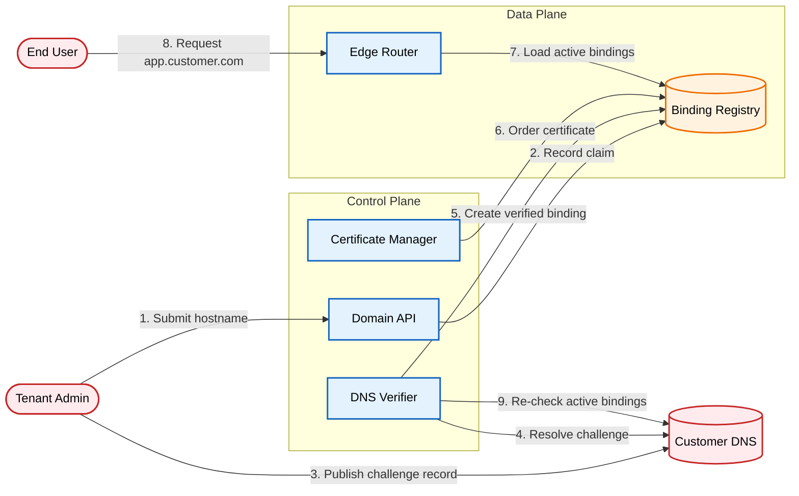

# Custom Domains: Binding Customer Hostnames to Tenants

A customer only needs to prove they own a domain once, but there is no ongoing check to confirm they still own it later.

[Read the full post on securepatterns.dev](https://newsletter.securepatterns.dev/p/custom-domains-binding-customer-hostnames-to-tenants)

## System Description

A tenant claims a hostname by showing they can update the customer's DNS zone. The platform then creates a binding between the hostname and the tenant, and the edge only serves the hostname while this binding is active. A scheduled job keeps checking the proof until the binding is released.

## Security Artifacts

- [Threat Model](threat_model.md): Risks across the claim, serve, and drift-and-release phases of the hostname binding lifecycle
- [Verification Checklist](checklist.md): A manual test list to audit your implementation
