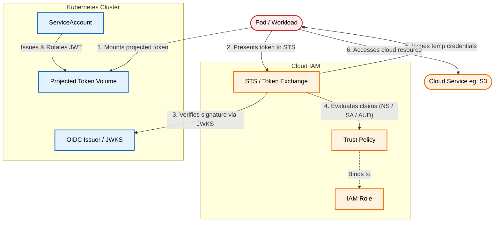

# Kubernetes Workload Identity: Eliminating Static Cloud Credentials

An architectural pattern for authenticating Kubernetes pods to cloud services (AWS, GCP, Azure) using short-lived, OIDC-federated ServiceAccount tokens instead of static IAM keys.

[**Read the full context on securepatterns.dev**](https://newsletter.securepatterns.dev/p/kubernetes-workload-identity-eliminating-static-cloud-credentials)

## System Description

In this pattern, a pod proves its identity to a cloud provider without static keys: Kubernetes issues a short-lived, signed token, the cloud verifies that token against the cluster's public keys, and, if the token matches a set of trust rules, exchanges it for temporary cloud credentials.

## Security Artifacts

- [Threat Model](threat_model.md): Risks across identity binding, token theft, audience misconfiguration, issuer spoofing, and OIDC drift
- [Verification Checklist](checklist.md): A manual test list to audit your implementation
