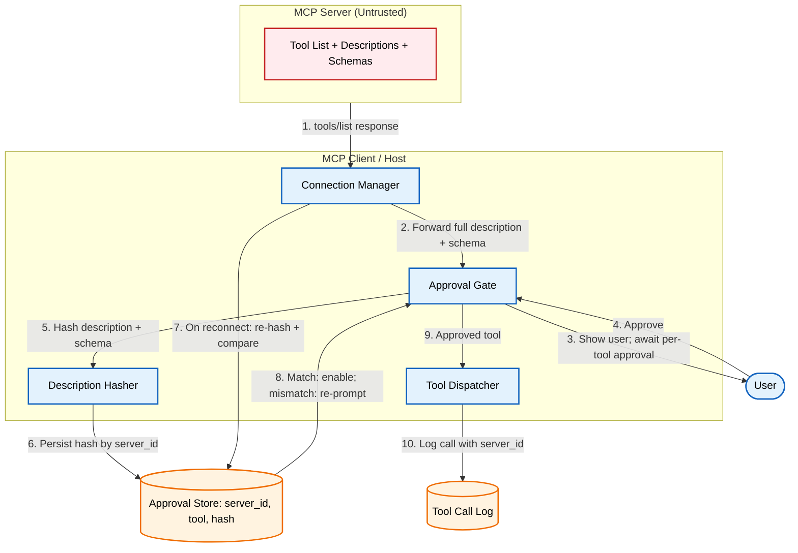

# Designing a Safe Approval Flow for MCP Tool Descriptions

An MCP server provides the tool description and input schema. The LLM uses both as part of its reasoning context when deciding how and when to call the tool. A server that can change a description after approval can change agent behavior without any application code change.

[**Read the full context on securepatterns.dev**](https://newsletter.securepatterns.dev/p/mcp-tool-poisoning-a-safe-approval-flow-for-tool-descriptions)

## System Description

The MCP client connects to a server and presents each returned tool's full description and input schema to the user for per-tool approval. The client hashes the approved description and schema against a stable server identity. On every subsequent connection it recomputes the hashes; any change blocks the tool until the user re-approves.

## Security Artifacts

- [Threat Model](threat_model.md): Risks at first-time approval and across the connection lifecycle, plus how the profile shifts under gateway-mediated approval
- [Verification Checklist](checklist.md): A manual test list to audit your implementation
