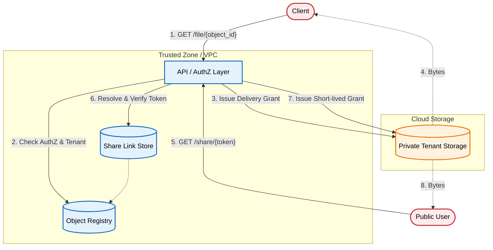

# Multi-Tenant File Sharing: Secure Control Plane Architecture

An architectural pattern for decoupling storage from authorization to ensure strict tenant isolation and secure object sharing.

[**Read the full context on securepatterns.dev**](https://newsletter.securepatterns.dev/p/multi-tenant-file-sharing-secure-control-plane-architecture)

## System Description

Object storage services (S3, GCS) are effectively infinite, flat key–value stores. They do not understand your application’s concepts of users, tenants, or sharing.

Secure multi-tenant file sharing requires a control plane: an application-owned registry that decouples where bytes live from who is allowed to access them. Storage is the data plane. Authorization lives entirely in your app.

## Security Artifacts

- [Threat Model](threat_model.md): A detailed breakdown of risks (IDOR, Confused Deputy, Token Leakage) and their specific mitigations
- [Verification Checklist](checklist.md): A manual test list to audit your implementation
