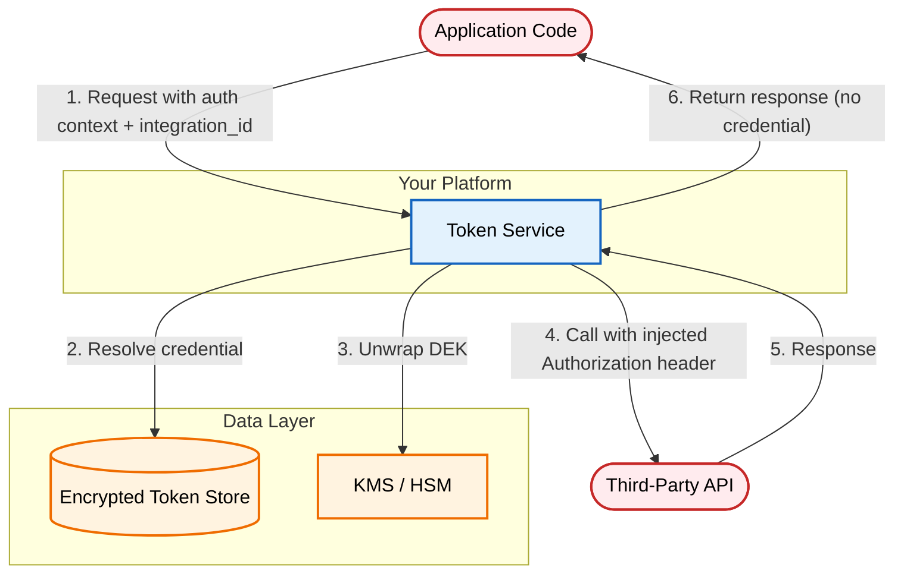

# OAuth Token Storage: Securing Third-Party Credentials in Multi-Tenant SaaS

An architectural pattern for storing and using third-party OAuth tokens in multi-tenant SaaS. A centralized token service encrypts credentials per tenant, refreshes them under lock, and mediates all outbound API calls so that application code never touches raw tokens.

[**Read the full context on securepatterns.dev**](https://newsletter.securepatterns.dev/p/oauth-token-storage-securing-third-party-credentials-in-multi-tenant-saas)

## System Description

A centralized token service encrypts and stores OAuth credentials per tenant, refreshes them under lock, and makes outbound API calls on behalf of application code. Application code sends requests in authenticated tenant context, specifying `integration_id`; it never receives, caches, or persists credentials itself.

## Security Artifacts

- [Threat Model](threat_model.md): Risks across token storage, lifecycle management, and outbound token use phases
- [Verification Checklist](checklist.md): A manual test list to audit your implementation
