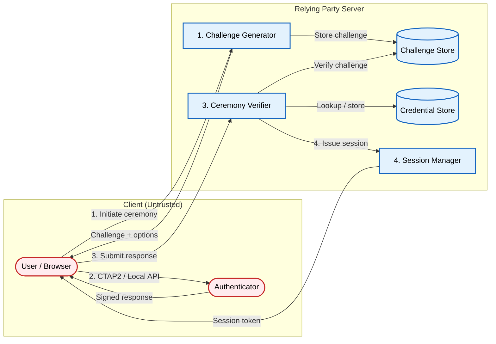

# Passkey Authentication: Architecting a Secure Relying Party

An architectural pattern for implementing passkey authentication at the relying party: ceremony verification, credential storage, and the trust boundaries between browser, authenticator, and your server. The RP never stores a shared secret; it stores a public key and verifies signatures produced by an authenticator the user controls.

[**Read the full context on securepatterns.dev**](https://newsletter.securepatterns.dev/p/passkey-authentication-architecting-a-secure-relying-party?draft=true)

## System Description

A relying party issues random challenges, verifies signed responses from authenticators, and stores credential public keys. Two ceremonies define the protocol: registration (create a credential) and authentication (prove you hold it). The browser mediates both ceremonies, enforcing origin binding before the authenticator ever sees the request.

## Security Artifacts

- [Threat Model](threat_model.md): Risks across ceremony integrity, credential management, and post-ceremony session phases
- [Verification Checklist](checklist.md): A manual test list to audit your implementation
