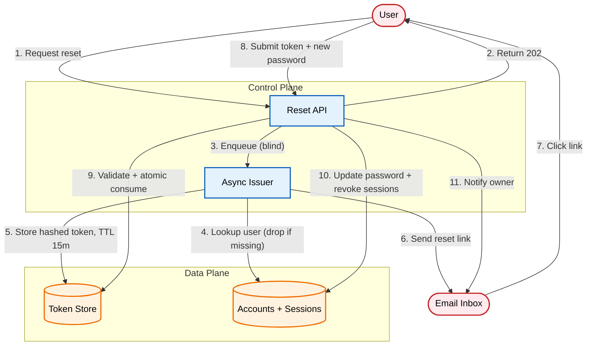

# Password Reset Flows: The Secure Implementation Guide

An architectural pattern for password reset: a generic request endpoint, stateful single-use tokens, atomic consume with policy validation first, full session revocation, and a notification email as the compensating control. The API issues short-lived tokens by email; submitting a valid token with a new password updates the credential and revokes existing sessions in the same transaction.

[**Read the full context on securepatterns.dev**](https://newsletter.securepatterns.dev/p/password-reset-flows-the-secure-implementation-guide)

## System Description

An API issues short-lived, single-use reset tokens via email. Submitting a valid token with a new password updates the password and revokes existing sessions. A separate email notifies the owner.

## Security Artifacts

- [Threat Model](threat_model.md): Risks across request intake, token lifecycle, and post-reset state phases
- [Verification Checklist](checklist.md): A manual test list to audit your implementation
