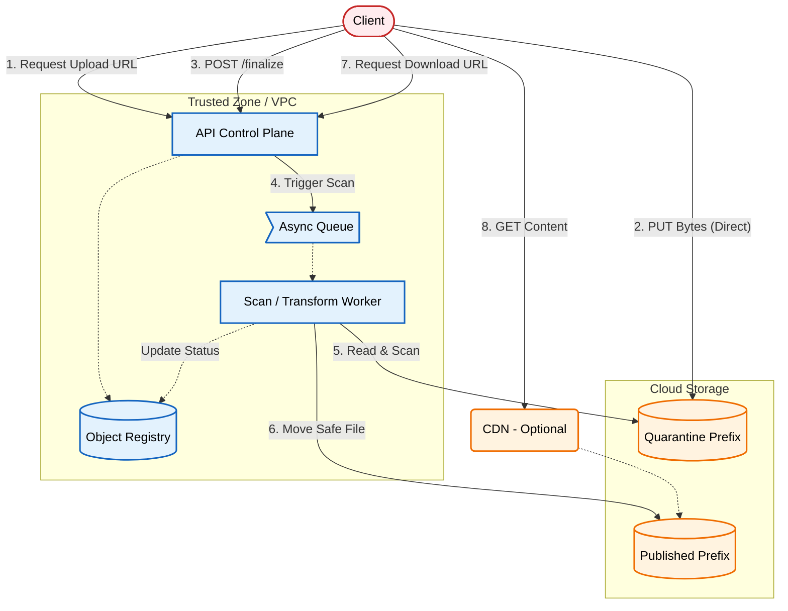

# Pre-signed URLs: The Secure Implementation Guide

An architectural pattern for handling direct-to-storage uploads without exposing your application to malware hosting, cost abuse, or unverified content.

[**Read the full context on securepatterns.dev**](https://newsletter.securepatterns.dev/p/pre-signed-urls-the-secure-implementation-guide)

## System Description

In this pattern, the API issues short-lived, exact-scope URLs for direct storage uploads. To keep the system safe, the app enforces a strict pipeline: **Quarantine → Finalize → Scan → Publish**.

## Security Artifacts

- [Threat Model](threat_model.md): A detailed breakdown of risks (TOCTOU, DoS, IDOR) and their specific mitigations
- [Verification Checklist](checklist.md): A manual test list to audit your implementation
