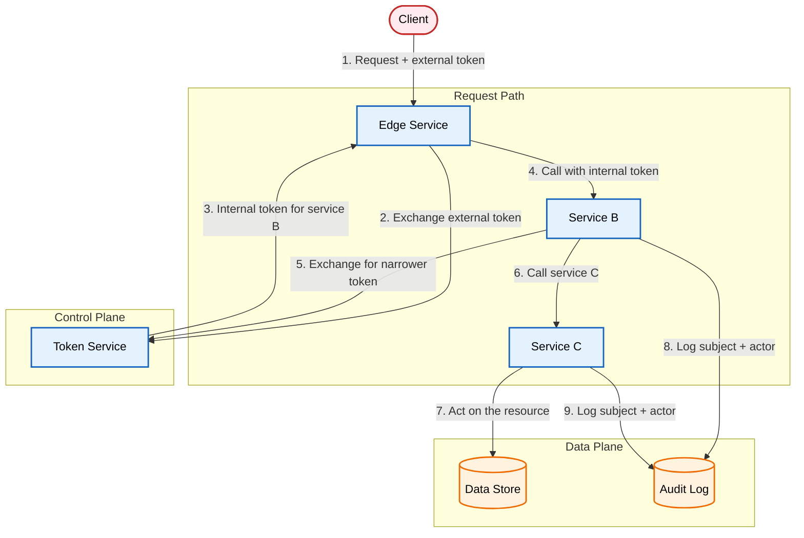

# Preserving User Authorization Across Services

A request three services deep should still name the user who started it.

[Read the full post on securepatterns.dev](https://newsletter.securepatterns.dev/p/preserving-user-authorization-across-services)

## System Description

A user request crosses several internal services before it touches data. The external token stops at the edge service, which exchanges it for a short-lived internal token carrying the user and tenant. Each downstream service verifies the calling workload and authorizes its own action against that context.

## Security Artifacts

- [Threat Model](threat_model.md): Risks across minting and exchange, the call chain, and deferred work and audit
- [Verification Checklist](checklist.md): A manual test list to audit your implementation
