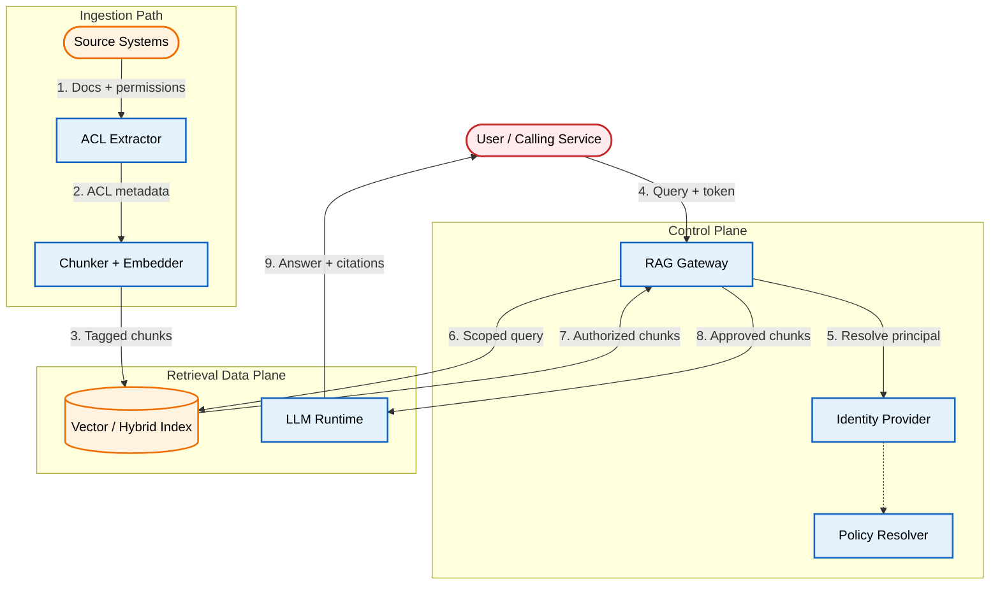

# Threat Modeling RAG Access Control

An architectural pattern for preserving source document permissions through RAG retrieval: server-side scope derivation, ACL metadata propagation during ingestion, hard pre-filters at query time, and session isolation in prompt assembly. The source document system is the authority for permissions; the retrieval index is a derived projection.

[**Read the full context on securepatterns.dev**](https://newsletter.securepatterns.dev/p/threat-modeling-rag-access-control)

## System Description

A RAG access control system resolves caller identity and derives an authorization scope from verified credentials and policy. It retrieves only chunks bound to that scope, and only approved chunks reach the model. The source document system is the authority for permissions and lifecycle state. The retrieval index is a projection, not the source of truth.

## Security Artifacts

- [Threat Model](threat_model.md): Risks across ingestion, query-time retrieval, and prompt assembly phases
- [Verification Checklist](checklist.md): A manual test list to audit your implementation
