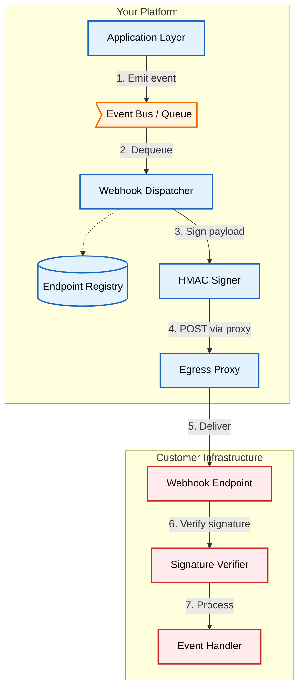

# Secure Webhook Delivery: Signing, Verification, and SSRF Prevention

An architectural pattern for webhook delivery: HMAC signing, receiver-side verification, and SSRF prevention through egress proxies and DNS rebinding defenses. The sender signs every payload with a per-endpoint secret and delivers through a network-level egress proxy; the receiver verifies the signature and timestamp before processing.

[**Read the full context on securepatterns.dev**](https://newsletter.securepatterns.dev/p/secure-webhook-delivery-signing-verification-and-ssrf-prevention)

## System Description

An event system detects state changes, signs the payload with a per-endpoint secret, and delivers an HTTP POST through an egress proxy that blocks internal network ranges. The customer's server verifies the signature, checks the timestamp, and processes the event idempotently.

## Security Artifacts

- [Threat Model](threat_model.md): Risks across webhook registration, delivery, and receiver-side verification phases
- [Verification Checklist](checklist.md): A manual test list to audit your implementation
