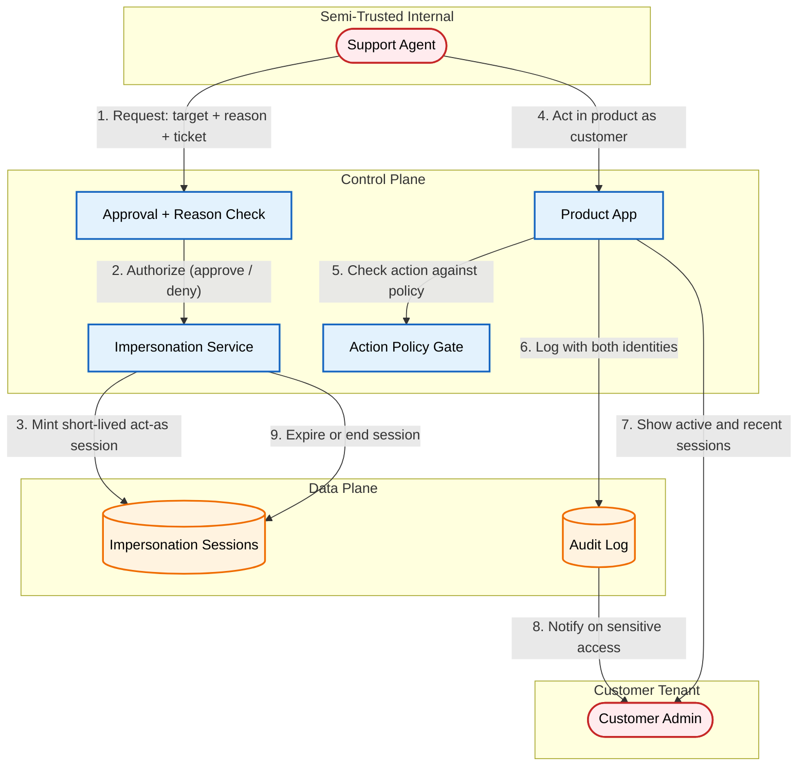

# Designing a Safe Support Impersonation Flow

Support impersonation lets an engineer act inside a customer's account to reproduce a bug or unstick a broken state. If the implementation simply swaps the engineer into the customer's session, actions land under the customer's name with no record of who really took them, and the support tool hands over the same authority as the customer with none of the constraints.

The safer pattern is a separate, short-lived act-as credential that names both the agent and the customer on every action, keeps high-risk operations blocked by default, makes the session visible to the customer, and ends on a timeout or on demand.

[**Read the full context on securepatterns.dev**](https://newsletter.securepatterns.dev/p/designing-a-safe-support-impersonation-flow)

## System Description

An impersonation session is a separate, short-lived credential that lets a named support agent act as a specific customer, with both identities recorded on every action. The agent never receives the customer's real session, and high-risk actions stay blocked for the duration.

## Security Artifacts

- [Threat Model](threat_model.md): Risks across the authorization, active-session, and teardown phases, with mitigation options keyed to the act-as session, the action policy, and the audit trail
- [Verification Checklist](checklist.md): A manual test list to audit your implementation
