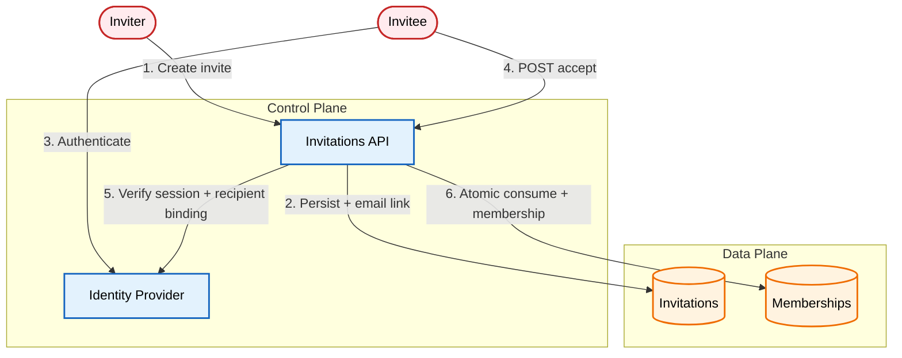

# Designing a Safe Team Invitation Flow

An architectural pattern for team invitations: a server-side pending grant, a short-lived claim token in the email, and an atomic accept handler that binds the invitation to an independently verified identity before writing membership. An admin requests an invite; the API persists a pending grant and sends an email link; the invitee signs in and accepts; the server matches the session's verified email to the invitation and writes membership in a single transaction.

[**Read the full context on securepatterns.dev**](https://newsletter.securepatterns.dev/p/designing-a-safe-team-invitation-flow)

## System Description

Every invitation lives server-side as a pending grant. The email carries only a short-lived claim token. To accept, the recipient signs in; the server matches the session's verified email to the invitation and writes the membership in a single transaction.

## Security Artifacts

- [Threat Model](threat_model.md): Risks across issuance, token and email, acceptance, and post-acceptance phases
- [Verification Checklist](checklist.md): A manual test list to audit your implementation
