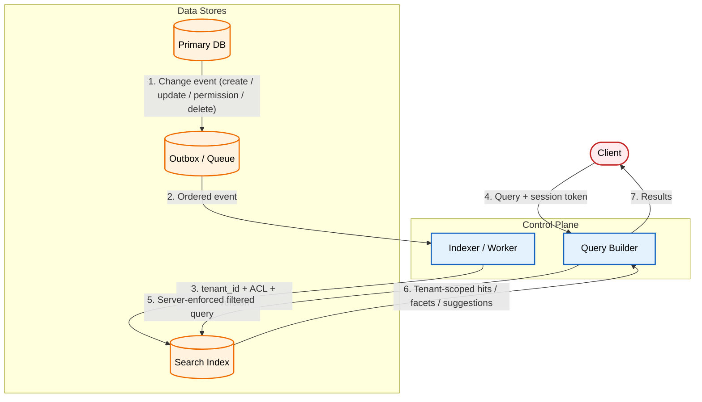

# Tenant-Safe Search Indexing

Your search index is a second copy of your data, so it needs the same access rules as the database it came from.

[Read the full post on securepatterns.dev](https://newsletter.securepatterns.dev/p/tenant-safe-search-indexing)

## System Description

A search subsystem indexes tenant records into an engine and tags each document with its tenant on write. Every query enforces that boundary. The primary database stays the authority for permissions and lifecycle; the index is a derived copy it keeps in sync.

## Security Artifacts

- [Threat Model](threat_model.md): Risks across indexing, query-time, and propagation/reindex phases
- [Verification Checklist](checklist.md): A manual test list to audit your implementation
